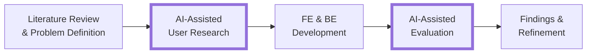
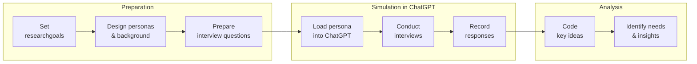
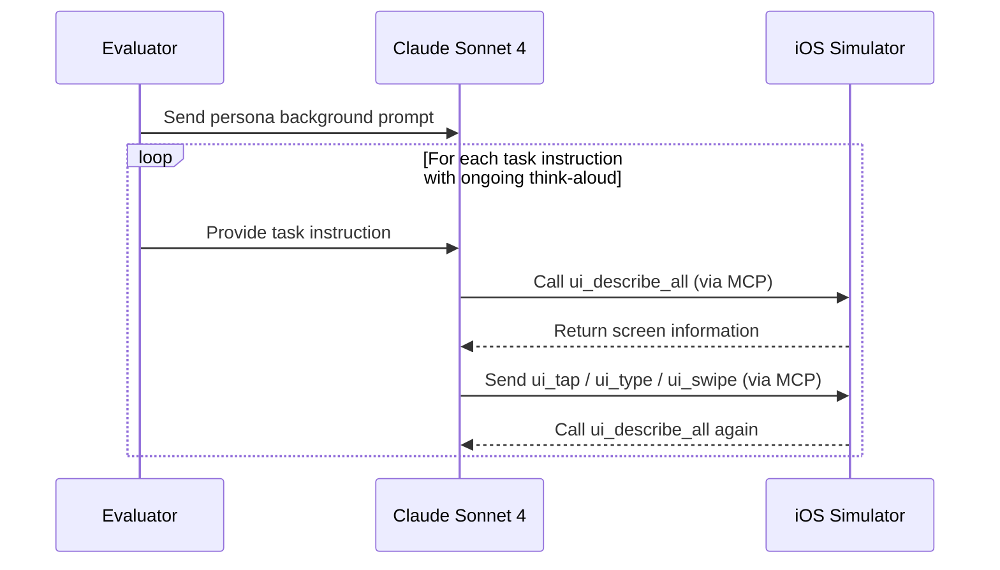

# Ting Mate – AI-Assisted User Research and Evaluation

This repository explains the **AI-assisted research stages** of [Ting Mate](https://github.com/vivi2393142/ting-mate-frontend), a mobile app designed for memory-impaired individuals and older adults.

It focuses on two key phases: **User Research** and **Evaluation**, both powered by Large Language Models (LLMs).

In these stages, simulated personas were used to gather user needs and test usability when real participants were difficult to reach. The insights guided the app’s design, accessibility features, and task workflows.

## AI-Assisted User Research

GPT-based personas were created with demographic and contextual backgrounds. Then, they engaged in multi-turn interviews to express needs, frustrations, and expectations. Lastly, responses were coded to identify design priorities, accessibility challenges, and recurring themes.

## AI-Assisted Evaluation

LLM personas operated the Ting Mate app through the iOS Simulator using the Model Context Protocol (MCP). They received screen descriptions, performed actions (tap, type, swipe), and provided real-time think-aloud feedback. This enabled automated usability testing and refinement without human participants.

## Repository Structure

| Folder                                       | Description                                                |
| -------------------------------------------- | ---------------------------------------------------------- |
| [`personas_design.md`](./personas_design.md) | Persona definitions and creation methods                   |
| [`user_research/`](./user_research/)         | Interview stage: prompts, transcripts, analysis            |
| [`evaluation/`](./evaluation/)               | Evaluation stage: methodology, transcripts, coded findings |

## Related Repositories

- [Ting Mate – Frontend (React Native + Expo)](https://github.com/vivi2393142/ting-mate-frontend)
- [Ting Mate – Backend (FastAPI)](https://github.com/vivi2393142/ting-mate-backend)
